# OpenCode Kapsamlı Mimari İncelemesi ve Sentinel Tam Entegrasyon Master Planı

Bu doküman, açık kaynaklı **OpenCode** AI otonom kodlama projesinin (`packages/` altındaki tüm 32 modül: `core`, `codemode`, `llm`, `plugin` (MCP), `containers`, `session`, `permission`, `snapshot`, `server`, `protocol`, `tui`, `ripgrep`) satır satır incelenmesiyle hazırlanan **eksiksiz ve derinlemesine** entegrasyon referansıdır.

**Sentinel Hedef Mimarisi:** C++20 / Qt 6 / QML / SQLite (Fedora KDE Plasma optimize, çapraz platform).

---

## 🗺️ OpenCode Tam Modül Haritası & Sentinel Karşılıkları

```mermaid
graph TB
    subgraph OpenCode_Ecosystem [OpenCode Mimarisi]
        CM[CodeMode: Scripted Tool Orchestration]
        MCP[Plugin: Model Context Protocol MCP]
        CP[LLM: Prompt Caching & Reasoner Tokens]
        SC[Session: Compaction & Forking Trees]
        SS[Snapshot: Git-Tree FS Rollback]
        PTY[PTY: Interactive Shell & Output Store]
        GW[Git: Subagent Isolated Worktrees]
        CT[Containers: MicroVM / Podman Sandboxing]
        RG[Ripgrep: Fast Code Search]
        SRV[Server: Local Daemon & Multi-Client Sync]
    end

    subgraph Sentinel_Integration [Sentinel C++ / Qt 6 / QML Entegrasyonu]
        S_CM[core/agent/ToolOrchestrator Sandbox]
        S_MCP[plugins/mcp/ MCP Stdio/SSE Client]
        S_CP[core/chat/PromptCacheManager]
        S_SC[core/chat/ContextCompactor & SessionTree]
        S_SS[core/platform/FileSnapshotService]
        S_PTY[core/platform/PtyProcessManager]
        S_GW[core/agent/WorktreeBranchService]
        S_CT[core/security/PodmanSandboxService]
        S_RG[core/search/RipgrepNativeService]
        S_SRV[core/runtime/SentinelDaemonEngine]
    end

    CM --> S_CM
    MCP --> S_MCP
    CP --> S_CP
    SC --> S_SC
    SS --> S_SS
    PTY --> S_PTY
    GW --> S_GW
    CT --> S_CT
    RG --> S_RG
    SRV --> S_SRV
```



---

## 1. 🚀 Öne Çıkan 10 Kritik Mimari Yenilik

### 1.1. CodeMode: Betik Tabanlı Araç Orkestrasyonu (`packages/codemode`)
* **Problem:** Bir model karmaşık bir görevde 10 farklı aracı sırayla çağırdığında 10 kez LLM round-trip yapar. Araçların büyük ara çıktıları model context'ini tüketir ve aşırı token maliyeti oluşturur.
* **OpenCode Çözümü:** Modele 50 ayrı araç açmak yerine tek bir `execute` aracı ve hafif bir betik çalışma ortamı (sandboxed JS interpreter) sunar.
  * Model tek bir betik yazar:
    ```javascript
    const [files, status] = await Promise.all([
      tools.glob({ pattern: "**/*.cpp" }),
      tools.git.status()
    ]);
    const matches = files.filter(f => status.modified.includes(f));
    return { targetFiles: matches };
    ```
  * Araçlar paralel çalışır, büyük ara veriler host içinde filtrelenir ve LLM'e sadece nihai sonuç döner.
* **Sentinel Entegrasyonu:**
  * `core/agent/ScriptedToolExecutor.h` (QJSEngine veya gömülü QuickJS / WebAssembly sandbox).
  * 10 kat daha az token harcayan, paralel araç çağıran ajan modu.

---

### 1.2. Akıllı Prompt Önbellekleme Noktaları (`packages/llm/src/cache-policy.ts`)
* **OpenCode Çözümü:**
  * Anthropic, Gemini ve Bedrock için otomatik `CacheHint` (Prompt Caching) stratejisi uygular:
    * **1. Kırılma Noktası:** Araç tanımlarının sonu (`tools`).
    * **2. Kırılma Noktası:** Sistem promptunun sonu (`system`).
    * **3. Kırılma Noktası:** En son kullanıcı mesajı (`latest-user-message`).
  * Ajan 20 adımlı bir döngüde çalışırken sabit sistem talimatları ve kullanıcı girdisi cache'ten (%90 indirimli ve milisaniye hızında) okunur.
* **Sentinel Entegrasyonu:**
  * `core/chat/ClaudeProvider.cpp` ve `GeminiProvider.cpp` içine `applyCachePolicy()` kırılma noktalarının eklenmesi.

---

### 1.3. Model Context Protocol (MCP) İstemcisi (`packages/plugin`)
* **OpenCode Çözümü:**
  * Anthropic'in açık standart MCP (Model Context Protocol) protokolünü hem `stdio` (yerel CLI sunucuları) hem de `sse` (uzak web servisleri) üzerinden destekler.
* **Sentinel Entegrasyonu:**
  * `plugins/mcp/McpClientService.h` ile GitHub, PostgreSQL, Brave Search, Slack, Linear, Docker gibi yüzlerce hazır MCP sunucusuna tek tıkla bağlanma.
  * QML Ayarlar sayfasına "MCP Sunucuları" yönetim paneli.

---

### 1.4. İzole Git Worktree ile Alt Ajan Güvenliği (`packages/core/src/git.ts`)
* **OpenCode Çözümü:**
  * Bir alt ajan (`subagent`) paralel veya deneysel bir kod yazma görevine başladığında, kullanıcının ana çalışma dizinini kirletmemek için geçici bir `git worktree add .sentinel/worktrees/<id>` açar.
  * İş başarıyla testlerden geçerse ana dala rebase/merge edilir; başarısız olursa tek komutla yok edilir.
* **Sentinel Entegrasyonu:**
  * `core/agent/SubAgentManager.h` altında iş parçacığı veya süreç bazlı izole worktree yönetimi.

---

### 1.5. İnteraktif PTY (Sudo / Parola / TUI Komutları) (`packages/core/src/pty.ts`)
* **OpenCode Çözümü:**
  * Basit `QProcess` stdout pipe'ı yerine gerçek bir Pseudo-Terminal (PTY) oluşturur.
  * `npm init`, `git rebase -i` veya parola/onay isteyen komutlarda kilitlenmez; kullanıcıya arayüzden etkileşimli stdin akışı sağlar.
* **Sentinel Entegrasyonu:**
  * Linux/macOS için `openpty()` / `forkpty()`, Windows için `CreatePseudoConsole` (ConPTY) sarmalayıcısı (`core/platform/PtyManager.h`).

---

### 1.6. Git-Backed Dosya Snapshot ve 1-Tıkla Geri Alma (`packages/core/src/snapshot.ts`)
* **OpenCode Çözümü:**
  * Ajan dosya yazmadan önce SHA256 içerik adresli anlık durum kaydı (`Snapshot.capture()`) alır.
  * Unified diff oluşturur, kullanıcının onayına sunar ve istenirse `restore()` ile dosyaları milisaniyede eski haline döndürür.
* **Sentinel Entegrasyonu:**
  * `core/platform/FileSnapshotService.h` + QML "Geri Al" (Undo) eylemi.

---

### 1.7. Akıllı Bağlam Sıkıştırma (Compaction & Epochs) (`packages/core/src/session/compaction.ts`)
* **OpenCode Çözümü:**
  * `buffer: 20_000` token eşiğinde otomatik çalışan şablonlu özetleyici:
    * `Objective`, `Important Details`, `Work State (Completed/Active/Blocked)`, `Next Move`, `Relevant Files`.
  * Context Epoch sıfırlaması ile sonsuz uzunlukta konuşma desteği.
* **Sentinel Entegrasyonu:**
  * `core/chat/ContextCompactor.h` ve `TokenBudgetEstimator.h`.

---

### 1.8. Canlı Todo ve İnteraktif Soru Araçları (`packages/core/src/tool/`)
* **`todowrite`:** Ajanın canlı ilerleme çubuğu ve görev adımları (`Pending`, `In-Progress`, `Completed`, `Blocked`).
* **`question`:** Ajanın kararsız kaldığında kullanıcıya çoktan seçmeli veya serbest metinli soru sorması (`(Recommended)` desteği ile).
* **`apply_patch`:** Tüm dosyayı yazmak yerine diff hunk'larını uygulayan %80 tasarruflu dosya düzenleyici.
* **`ManagedToolOutput`:** 2.000 karakteri aşan terminal çıktılarını disk tamponuna alıp modele özet sunma.

---

### 1.9. Kural Tabanlı İzin ve Sandboxing (`packages/core/src/permission/`, `packages/containers`)
* **OpenCode Çözümü:**
  * Regex desenleri (`rm -rf`, `sudo`, `curl | bash` -> Zorunlu Onay; `git status`, `ls` -> Otomatik İzin).
  * Çalışma dizini dışına çıkışlarda güvenlik duvarı.
  * Docker / Podman (Rootless) konteyner içinde güvenli ajan çalıştırma.
* **Sentinel Entegrasyonu:**
  * Fedora / Linux için `podman` ve `bubblewrap` (bwrap) sandbox desteği (`core/security/BubblewrapSandbox.h`).

---

### 1.10. Arkaplan Servisi (Daemon Mode) & Çoklu İstemci (`packages/server`, `protocol`)
* **OpenCode Çözümü:**
  * Ajan motoru arkaplanda yerel bir daemon (HTTP/WebSocket/SSE) olarak çalışabilir.
  * TUI, Masaüstü GUI ve harici IDE eklentileri aynı ajana aynı anda bağlanıp canlı akışı izleyebilir.
* **Sentinel Entegrasyonu:**
  * Sentinel Desktop ve Sentinel CLI/Tray servisinin aynı `SentinelDaemonEngine` çekirdeğini paylaşması.

---

## 📊 Kapsamlı Entegrasyon Matrisi

| # | Özellik / Kalıp | İlgili OpenCode Modülü | Sentinel Hedef Dosyası | Zorluk | Öncelik |
| :--- | :--- | :--- | :--- | :--- | :--- |
| **1** | **`todowrite` Canlı Görev Takibi** | `packages/core/src/tool/todowrite.ts` | `core/agent/TodoTool.h` + QML Stepper | Kolay | **P1** |
| **2** | **`question` İnteraktif Soru Modalı** | `packages/core/src/tool/question.ts` | `core/agent/QuestionTool.h` + QML Modal | Kolay | **P1** |
| **3** | **Büyük Çıktı Disk Sanallaştırma** | `packages/core/src/tool-output-store.ts` | `core/agent/ToolOutputStore.h` | Kolay | **P1** |
| **4** | **Prompt Caching Kırılma Noktaları** | `packages/llm/src/cache-policy.ts` | `core/chat/*Provider.cpp` | Kolay | **P1** |
| **5** | **Context Compaction (Özet Bellek)** | `packages/core/src/session/compaction.ts` | `core/chat/ContextCompactor.h` | Orta | **P2** |
| **6** | **`apply_patch` (Unified Diff Tool)** | `packages/core/src/tool/apply-patch.ts` | `core/runtime/PatchEngine.h` | Orta | **P2** |
| **7** | **Snapshot & 1-Tıkla Geri Alma (Undo)**| `packages/core/src/snapshot.ts` | `core/platform/FileSnapshotService.h` | Orta | **P2** |
| **8** | **MCP (Model Context Protocol) Client**| `packages/plugin/src/` | `plugins/mcp/McpClientService.h` | Orta | **P3** |
| **9** | **PTY Terminal & Etkileşimli Shell** | `packages/core/src/pty.ts` | `core/platform/PtyManager.h` | Orta | **P3** |
| **10**| **İzole Git Worktree Alt Ajanları** | `packages/core/src/git.ts` | `core/agent/WorktreeManager.h` | Orta | **P3** |
| **11**| **CodeMode (Betik Tabanlı Orkestrasyon)**| `packages/codemode/` | `core/agent/ScriptedToolExecutor.h` | İleri | **P4** |
| **12**| **Bubblewrap / Podman Sandboxing** | `packages/containers/` | `core/security/BubblewrapSandbox.h` | İleri | **P4** |
| **13**| **Oturum Çatallama (Session Forking)**| `packages/core/src/session/` | `core/chat/ConversationTree.h` | Orta | **P4** |
| **14**| **Daemon / Çoklu İstemci Senkronu** | `packages/server/` + `protocol/` | `core/runtime/DaemonServer.h` | İleri | **P5** |

---

## 🛠️ Uygulama Tavsiyesi

Sentinel'in modüler C++20 / Qt 6 monolitik yapısını ve Fedora KDE hedefini koruyarak, bu adımları sırayla hayata geçirebiliriz:

1. **İlk Sprint (Ajan Deneyimi & Token Verimliliği):**
   * `todowrite` + `question` araçları (QML UI kartlarıyla birlikte).
   * `cache-policy` (Prompt caching) ile API maliyetlerini %80 düşürme.
   * `ToolOutputStore` ile büyük bash çıktılarını filtreleme.
2. **İkinci Sprint (Hafıza & Kod Güvenliği):**
   * `ContextCompactor` (uzun görevlerde kayıpsız özetleme).
   * `apply_patch` ve `FileSnapshotService` (hızlı düzenleme + 1-tıkla Geri Al).
3. **Üçüncü Sprint (Genişletilebilirlik & Güvenlik):**
   * `MCP Client` entegrasyonu (dış araç ekosistemi).
   * PTY desteği ve Linux/Fedora için Bubblewrap/Podman kum havuzu.
