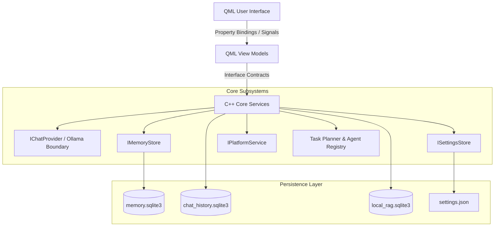

# Architecture Overview

Sentinel is architected as a **modular monolith** in C++20 and Qt 6, prioritizing high local performance, zero telemetry, and cross-platform portability.

---

## High-Level Architecture Diagram

---

## Architectural Principles

1. **Decoupled Business Logic**: Core application state and services do not depend on QML presentation elements.
2. **Interface Abstraction**: Core components expose pure C++ abstract interfaces (`IChatProvider`, `IMemoryStore`, `ISettingsStore`, `IPlatformService`).
3. **Platform Portability**: Platform-specific implementations (such as Fedora KDE Plasma integration) are isolated behind service interfaces.
4. **Strict Persistence Separation**: Key-value memory, chat history, local RAG vector data, and user settings are kept in dedicated database/file stores.
