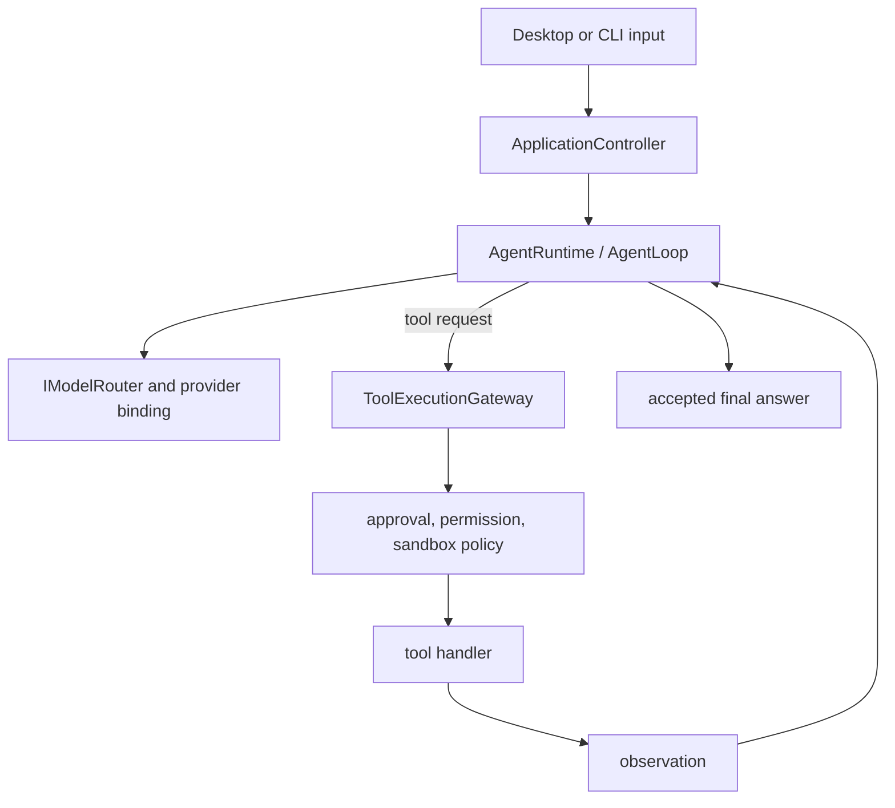

# Agent Runtime

**Status: Implemented.** Agent execution is multi-step and cancellable, but completion and capability availability remain policy- and provider-dependent.

Agent Mode enters through `AgentRuntime`. `LlmAgentRuntime` uses `AgentLoop` for multi-step execution; a tool completion is an observation, not completion of a run. Controlled tasks use the same runtime through `ControlledTaskService`, which owns records, session mapping, and `AgentEvent` projection.

An active run holds one `ModelBinding` resolved through `IModelRouter`. The loop can stream steps and final messages, accepts cancellation, enforces iteration limits, and uses doom-loop detection. Tool arguments are validated against the authoritative `ToolDescriptor` schema before a handler runs. Results are truncated where necessary before returning to the model context.

Natural-language input is never converted into a shell command by heuristic planning. Provider failures, rejected approvals, validation failures, cancellation, and tool failures remain run events or errors; only an accepted final answer completes the run.
