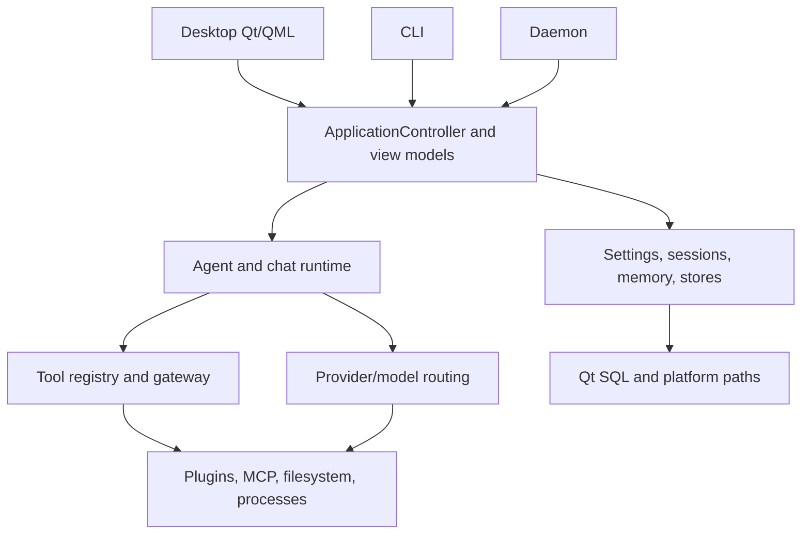

# Architecture

Sentinel is a C++20/Qt 6 modular monolith. Desktop, CLI, daemon, and plugin host are executable surfaces over the `sentinel_core` static library.

`apps/sentinel-desktop` owns the Qt/QML shell and bootstrap. QML is presentation; `DesktopShellViewModel` and related view models expose safe state and actions. `apps/sentinel-cli` is a partial, small command dispatcher. `apps/sentinel-daemon` is a partial local IPC/status service: it owns an application controller, periodically refreshes Ollama health, and accepts `ping`, status/health/models, and shutdown requests. It is not documented as a background agent-execution service. `apps/sentinel-plugin-host` supports the experimental plugin-host protocol.

`core/` owns the shared application controller and domain services. Agent work flows through `AgentRuntime`/`AgentLoop`; provider behavior through `IChatProvider` and `IModelRouter`; tools through `IToolRegistry`, `ToolDescriptor`, and `ToolExecutionGateway`. `IFileSystemService` and `ProcessExecutor` isolate system-facing tools. Platform functionality belongs behind interfaces such as `IPathProvider`, `IPlatformService`, and `ISystemIntegrationService`.

Persistence remains split: settings use `ISettingsStore`; memory uses `IMemoryStore`; history and conversations use their own stores; permission grants and agent runs have separate SQLite stores. Qt SQL is the SQLite path. Core should not depend on QML presentation or platform-only behavior.

The concurrency model uses Qt signals/events for UI and provider integration; agent execution scheduling and loop events keep active work observable and cancellable. See [Agent Runtime](../concepts/AGENT_RUNTIME.md) for run semantics.
